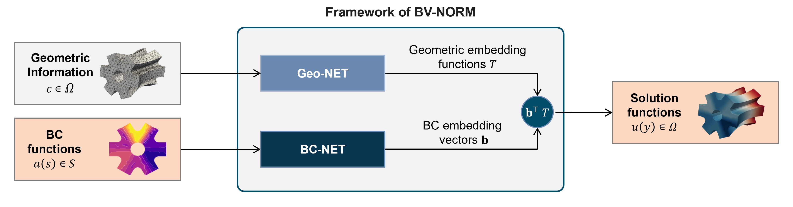
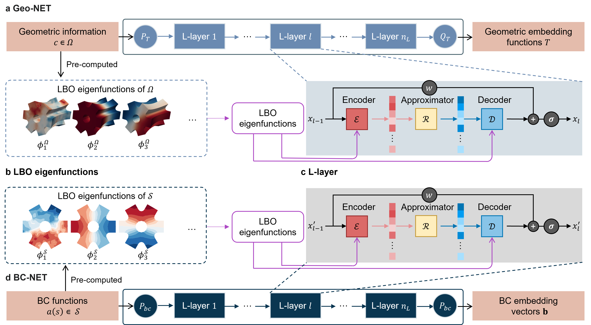
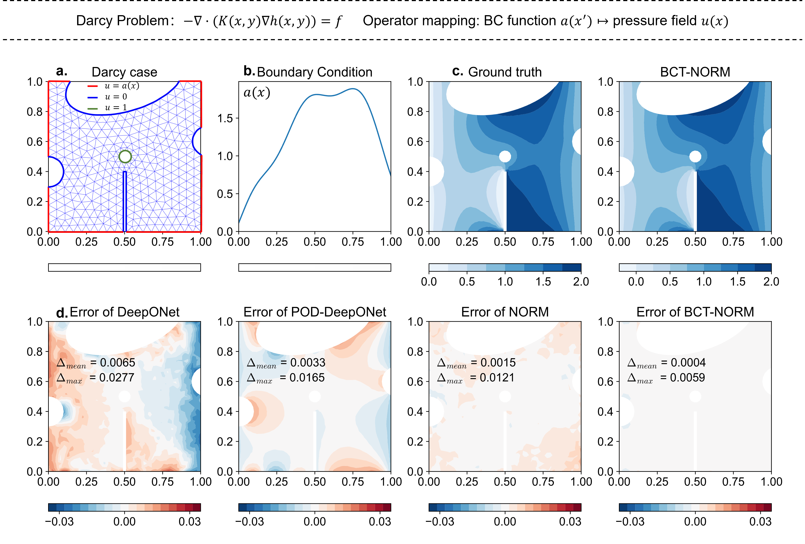
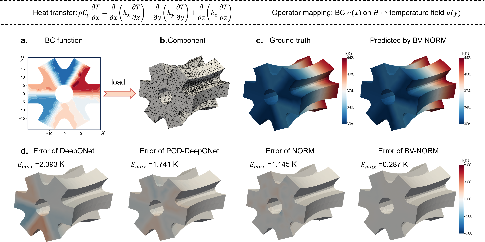
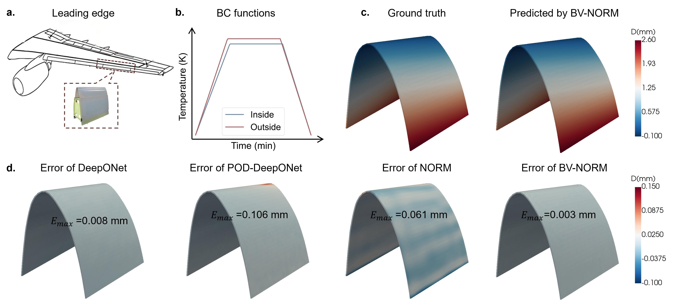

# BV-NORM: A neural operator learning framework for parametric boundary value problems on complex geometric domains in engineering
- This repository contains codes and datas accompanying our paper : _BV-NORM: A neural operator learning framework for parametric boundary value problems on complex geometric domains in engineering_. 
- For more details, feel free to contact us (fengliang@nuaa.edu.cn).
- 
## BV-NORM
- 
- 
- 
## Dependencies & packages
Dependencies:
- Python (tested on 3.8.13)
- PyTorch (tested on 1.11.0)
- lapy (tested on 0.6.0)

## Data
The shapes of dataset about the Case1-Case4:
```
Case1-Burgers.mat
├── Input: U_initial  4000*415*100
└── Output: U_field   4000*415
---------------------------------------------
Case2-Wave.mat
├── Input: U_field   2000*100*506
└── Output: U_source  2000*100
---------------------------------------------
Case3-Layout.mat
├── Input: layout  1200*1168
└── Output: T_field 1200*1168*151
---------------------------------------------
Case4-Qianyuan.mat
├── Input: Tair_time   600*151*6
└── Output: T_field       600*151*2743
---------------------------------------------
Case5-Qianyuan.mat
├── Input: T_field       600*151*2743
└── Output: D_field   600*2743
---------------------------------------------
Case6-BloodFlow.mat
├── Input: `BC_time`(500*121*6)
└── Output: `velocity_x`(500*1656*121),`velocity_y`,`velocity_z`
```

## Results
### Case1
- 
---------------------------------------------------
### Case2
- 
---------------------------------------------------
### Case3
- 
---------------------------------------------------
### Case4
- 
---------------------------------------------------


